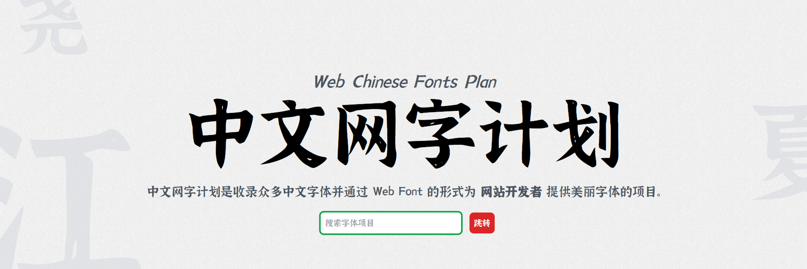
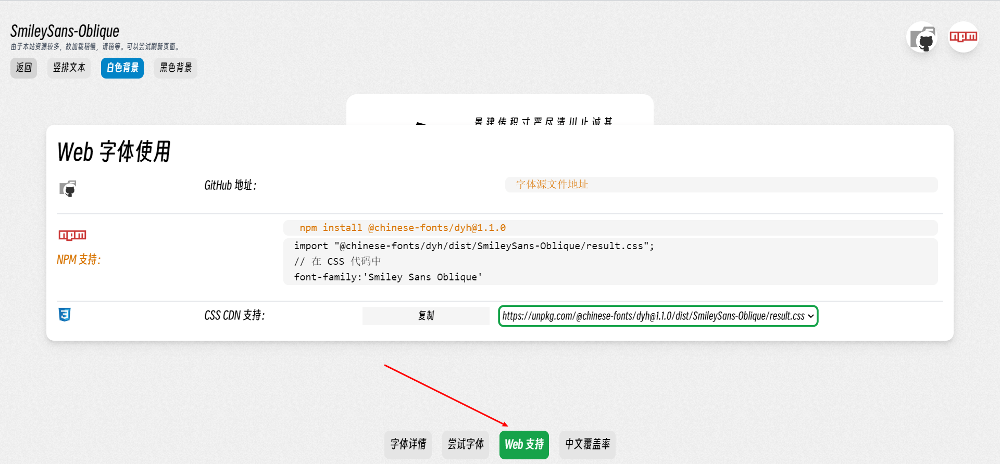

# 中文网字计划 v4

[Netlify 网页](https://chinese-font.netlify.app/)

## 简介

这是一个用于收集免费可商用的 **Web 字体文件** 的仓库！

由于中文的庞大字符数，中文字符在网页中的使用方案屈指可数。

我使用的字体加载方案是 **Google Font** 的 CSS 字体加载方案，使用 **CSS unicode-range + 浏览器** 按需请求载入文件！

并且项目根据文字常见程度分组并进行了分包，每个包的平均大小约为 50 kb 可以被浏览器迅速加载！

同时，我们的项目只需要在 packages 文件夹下放置字体源文件，项目自动打包分包，上传 NPM 给广大开发者使用！

## 项目目标

-   [x] Github Action 自动打包字体文件
-   [x] ttf 文件支持，woff2 文件支持
-   [ ] 联合 FontSource 项目，加载 Google Fonts！

## 我如何用？

> 如果你是开发者，可以在官网查看字体，并且点击 Web 支持
>
> 如果你是设计师，需要原始字体文件，你可以点击 Github 图标跳转下载



## 字体版权

请您尊重字体制作者的权益，我在制作的时候特地将字体文件的头部信息导出到了字体详情中，您可以详细查看制作者和授权等相关的数据。

## Material Icons 和 Google Fonts

> 准备完成的部分

Material Icons 和 Google Fonts 提供了非常良好的静态字体相关的服务给我们，但是部分地区并没有较好的方式进行 Google Fonts 的查看，所以我将 Google Fonts 的查询功能直接内置在我们的网页中，方便大家查询相关的 CSS 链接。

同时，我们采用了 FontSource 的 NPM 静态仓库进行相关数据和文件的获取，感谢 FontSource 的贡献。

## 注意事项

1. 有些中文字体没有英文部分，所以需要英文部分可以结合 Google Fonts 进行使用。
2. 使用 result.css 引入时，在同一个 DOM 上赋值两种字体可能会导致错误。

## 仓库证书

MIT License

## 您想要添加字体？

请在 Gitee 或者 Github 上提供字体的下载链接和版权声明，如果我有空会帮您的。

当然，您也可以直接 PR 一个分支，审核后会加入的。

```
npm run new dyh # dyh 是字体的中文拼音的第一个英文组合
# 完成后将会在 packages 文件夹多一个 dyh 文件夹

# 然后你在 packages/dyh/fonts 文件夹中放入您的字体文件

pnpm build --single=dyh --mode=check # 尝试打包文件

```
