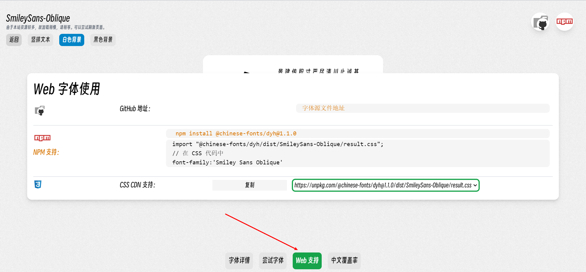

# 中文网字计划 v6

[Netlify 网页](https://chinese-font.netlify.app/)

[新模块 - font-now (直接上传并获取字体 CDN 链接)](https://font-now.netlify.app/)<br />

[](https://app.netlify.com/sites/chinese-font/deploys)

## 简介

这是一个收集免费可商用的 **Web 字体文件** 的 GitHub 项目！在网页中，由于中文字符庞大的特性，能够被兼容和使用的中文字体非常有限。所以我们的项目使用了特殊的中文字体切割方式，使得任何网站都可以全站全文本字体覆盖！

中文网字计划期望在网络中为实现中文字体的繁荣而努力。为此，我们进行了大规模中文字体网络化的研究和实践，实现了许多字体工具和解决方案。

1. [中文字体切割插件 @konghayao/cn-font-split](https://github.com/KonghaYao/cn-font-split)
2. [支持 Vite、Next、Nuxt、Webpack 的 vite-plugin-font](https://www.npmjs.com/package/vite-plugin-font)
3. [支持用户自定义上传字体的字体 CDN 服务](https://github.com/KonghaYao/font-now)

开发者只需要将字体源文件放置在 packages 文件夹下，项目将自动打包和分组。已发布到 NPM，欢迎广大开发者使用！

## 我如何用？

> 如果你是开发者，可以在官网查看字体，并且获取 Web 支持，直接引用 CSS 文件即可使用。
>
> 如果你是设计师，需要原始字体文件，你可以点击 Github 图标跳转下载



## 代码贡献者

<a href="https://github.com/KonghaYao/chinese-free-web-font-storage/graphs/contributors">
  
</a>

## 技术相关

1. 字体部署方案由 [cn-font-split](https://github.com/Konghayao/cn-font-split) 项目提供。从项目初始， cn-font-split 就作为中文网字计划的功能提供，帮助我们实现了网络字体的合理部署。
2. [Imagekit.io](https://imagekit.io/) 网站为我们的字体提供了静态文件解决方案，我们的字体部署于 Imagekit.io。
3. 中文网字计划期待有一个公益的 CDN 能够持续提供免费的字体服务，像 Google Font 一样支持广大开发者。

## Material Icons 和 Google Fonts

Material Icons 和 Google Fonts 提供了非常良好的静态字体相关的服务给我们，但是部分地区并没有较好的方式进行 Google Fonts 的查看。

所以我们将 Google Fonts 的查询功能直接内置在我们的网页中，方便大家查询相关的 CSS 链接。其中采用了 FontSource 的 NPM 静态仓库进行相关数据和文件的获取，感谢 FontSource。

## 开发与合作

## 开发者文档

为了防止我忘记上传与部署方式，我将说明写在了 Developer.md 文件中。

## 您想要添加字体？

> 我们只接收免费商用的字体

### 直接提交一个 issue

1. 在 Issue 面板上标明字体链接和授权信息即可

### 提交一个 PR

> 注意，需要 node 18 以上的版本

1. 准备字体链接和授权信息
2. fork 该项目

```sh
npm i # 安装项目
```

3. 按下面的代码启动

```sh
npm run new dyh # dyh 是字体的中文拼音的第一个英文组合
# 完成后将会在 packages 文件夹自动模板创建一个 dyh 文件夹

# 然后你在 packages/dyh/fonts 文件夹中放入您的字体文件

pnpm build --single=dyh  # 尝试打包文件

```

4. 提交 PR ，我们将会人工审核并上传字体

## 注意事项

1. 有些中文字体没有英文部分，所以需要英文部分可以结合 Google Fonts 进行使用。
2. 使用 result.css 引入时，在同一个 DOM 上赋值两种字体可能会导致错误。

## 证书

### 仓库证书

MIT License

### 字体版权

请您尊重字体制作者的权益，我在制作的时候特地将字体文件的头部信息导出到了字体详情中，您可以详细查看制作者和授权等相关的数据。
